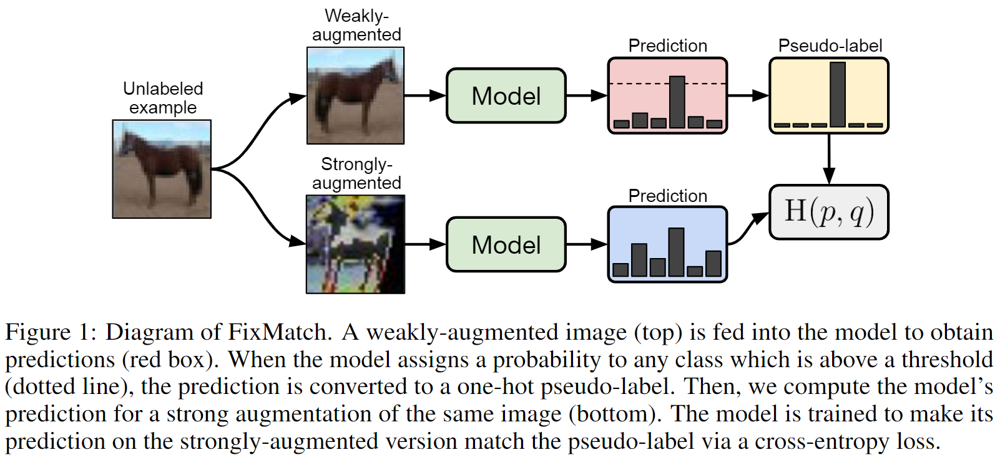

# FixMatch-Paddle

## 简介

使用 paddle 复现论文 [FixMatch: Simplifying Semi-Supervised Learning with Consistency and Confidence](https://arxiv.org/abs/2001.07685).



FixMatch 是 SSL（半监督学习） 两种常用方法的组合：一致性正则化和伪标签。它的主要新颖之处在于这两种成分的组合以及在执行一致性正则化时使用单独的弱增强和强增强。

在 CIFAR-10 上使用 250 个标签的准确率为 94.93%，使用 40 个标签的准确率为 88.61%。

参考开源 pytorch 代码 [FixMatch-pytorch](https://github.com/kekmodel/FixMatch-pytorch).

## 环境依赖

- python 3.7
- paddle 2.1
- visualdl
- numpy
- tqdm

## 复现精度

模型和训练日志可到百度网盘提取，链接：https://pan.baidu.com/s/14j8AQnvLgBFgCfZzHbfpxQ 
提取码：kimn

### CIFAR10

| #Labels | 40 | 250 | 4000 |
|:---:|:---:|:---:|:---:|
| Paper (RA) | 86.19 ± 3.37 | 94.93 ± 0.65 | 95.74 ± 0.05 |
| pytorch code | 93.60 | 95.22 | 95.77 |
| **paddle code** | 93.59 (epoch 190) | 95.20 (epoch 255) | 95.83 (epoch 156) |
| **model_best** | [model_best@40.pdparams](https://github.com/ImportPaddle/FixMatch-Paddle/releases/tag/trainv0.8) | [model_best@250.pdparams](https://github.com/ImportPaddle/FixMatch-Paddle/releases/tag/trainv0.8) | [model_best@4000.pdparams](https://github.com/ImportPaddle/FixMatch-Paddle/releases/tag/trainv0.8) |

## 快速开始

cifar10 数据集: [cifar-10-python.tar.gz](https://github.com/ImportPaddle/FixMatch-Paddle/releases/tag/trainv0.8)

### Train

- **单卡：**
    - 命令行1：使用 4000（40、250） 个有标签样本，从零开始训练:
    
    ```
    python train.py --dataset cifar10 \
        --num-labeled 4000 \
        --arch wideresnet --batch-size 64 --lr 0.03 \
        --expand-labels --seed 5 \
        --log-out results/cifar10@4000.5/logs \
        --out results/cifar10@4000.5 \
        --data-file path/to/cifar-10-python.tar.gz
    ```
    
    - 命令行2：从预训练模型继续训练，添加命令行参数 `--resume path/to/latest-ckpt`

- **单机 4 卡：**

    ```
    python -m paddle.distributed.launch --gpus '0,1,2,3' train.py \
        --dataset cifar10 \
        --num-labeled 4000 \
        --arch wideresnet --batch-size 64 --lr 0.095 \
        --expand-labels --seed 5 \
        --local_rank 0 \
        --log-out results/cifar10@4000.5/logs \
        --out results/cifar10@4000.5 \
        --data-file path/to/cifar-10-python.tar.gz \
        --resume path/to/latest-ckpt
    ```

### Test

- 方式1: 加载模型中保存的 dict:

    ```python
    import paddle 
    state=paddle.load("path/to/moddel_best.pdparams")
    print(state.keys())  # 查看model中保存的dict
    print('epoch:', state['epoch'])  # 查看是哪个epoch保存的最佳模型
    print(f"best acc: {state['best_acc']}")  # 查看模型的测试集精度
    ```

- 方式2: 使用命令行

    ```
    python test.py --dataset cifar10 \
        --arch wideresnet --batch-size 64 \
        --expand-labels --seed 5 \
        --data-file path/to/cifar-10-python.tar.gz \
        --model-best path/to/best-ckpt
    ```

## 八、模型信息

| 信息 | 说明 |
| --- | --- |
| 发布者 | [刘辰](https://github.com/ttjygbtj)、[吴海涛](https://github.com/Dylan-get)、[石华榜](https://github.com/S-HuaBomb)、[杨瑞智](https://github.com/buriedms)、[许观](https://github.com/HeySUPERMELON) |
| 时间 | 2021.10.25 |
| 框架版本 | paddlepaddle==2.1.2 |
| 应用场景 | 半监督图像分类 |
| 支持硬件 | GPU × 4 |
| 预训练模型下载 | 链接：https://pan.baidu.com/s/14j8AQnvLgBFgCfZzHbfpxQ 提取码：kimn |
| AI Studio 地址 | [FixMatch-Paddle](https://aistudio.baidu.com/aistudio/projectdetail/2509943?contributionType=1) |


## Citations

```
@article{sohn2020fixmatch,
    title={FixMatch: Simplifying Semi-Supervised Learning with Consistency and Confidence},
    author={Kihyuk Sohn and David Berthelot and Chun-Liang Li and Zizhao Zhang and Nicholas Carlini and Ekin D. Cubuk and Alex Kurakin and Han Zhang and Colin Raffel},
    journal={arXiv preprint arXiv:2001.07685},
    year={2020},
}
```
